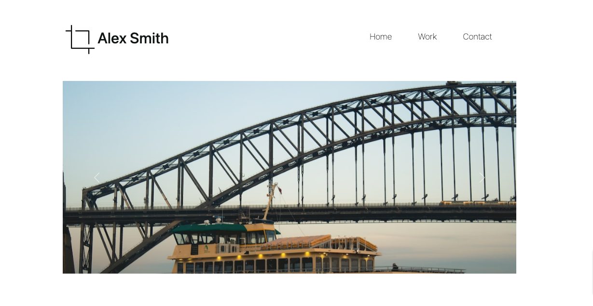
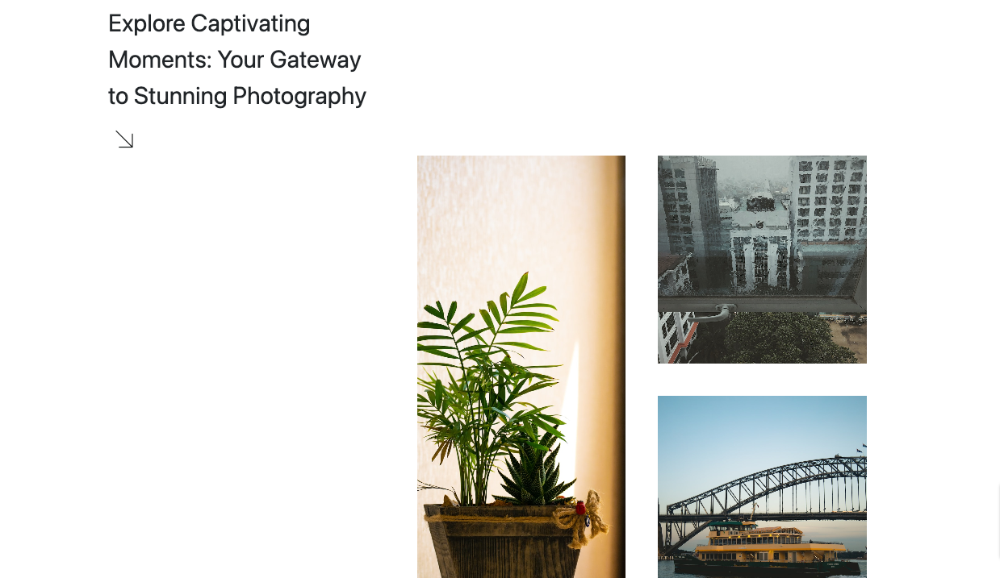
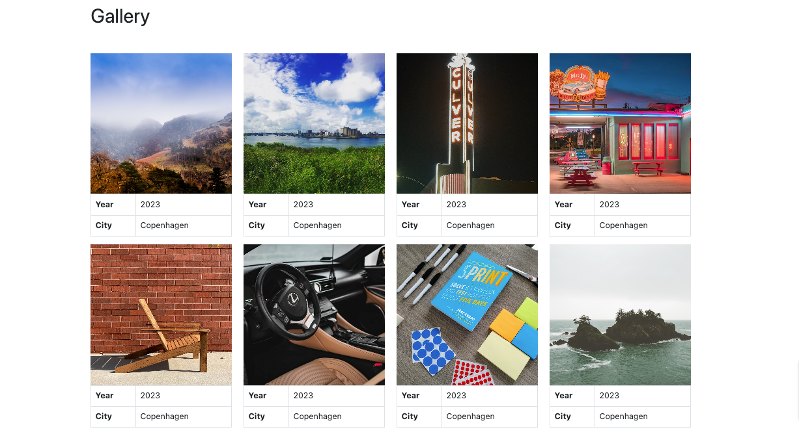
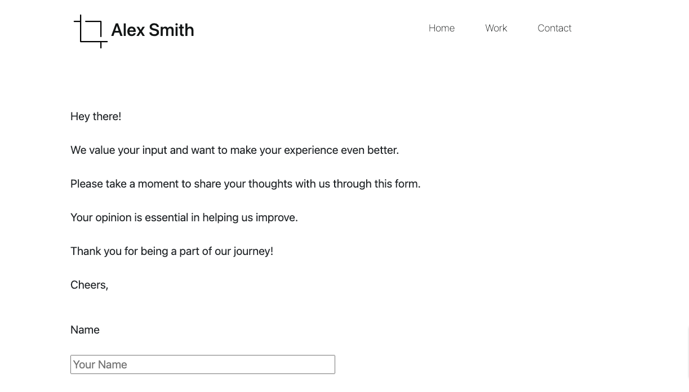

# Full-Stack Webpage

 

[Click here to see the project](https://bellacristsantos.github.io/Full-Stack-Webpage/pages/home.html)

 

 
 

## :bulb: Creative Photography Website

 

This project represents a captivating and creative photography website designed to showcase stunning moments captured through the lens. It encompasses an array of interconnected HTML files and CSS styles. The core concept of this project is to provide a visually appealing platform to explore the world of photography, engaging users with captivating visuals and content.

 

## :round_pushpin: Key Features

 

:white_medium_small_square: HTML Structure  
:white_medium_small_square: CSS Styling  
:white_medium_small_square: IFrames  
:white_medium_small_square: Image Display 
:white_medium_small_square: Typography  
:white_medium_small_square: Content  

 

## :round_pushpin: Concept Development

:white_medium_small_square: Visual Aesthetics  
:white_medium_small_square: Structured Content  
:white_medium_small_square: Image Grid  
:white_medium_small_square: Dynamic Components   

 
